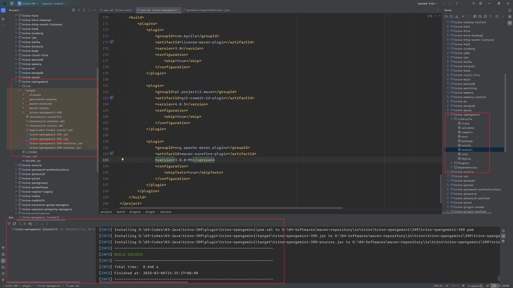

[中文](./README_ZH.md) | [Englist](./README.md)

# trino-openGemini-plugin

trino-openGemini-plugin是分布式SQL引擎Trino的一个插件，通过该插件，您可以直接使用Trino访问openGemini。

## 安装部署

参照[Deploying Trino — Trino 399 Documentation](https://trinodb.github.io/docs.trino.io/399/installation/deployment.html)，以下是基于`Ubuntu24.04`、`Java 17.0.11`和`Python 3.12.3`的部署实例。

1. 下载trino的二进制包 [trino-server-399.tar.gz](https://repo1.maven.org/maven2/io/trino/trino-server/399/trino-server-399.tar.gz)，并解压

   ```bash
   $ tar xf trino-server-399.tar.gz
   ```

2. 解压`trino-opengemini-399.zip`文件, 可以自己编译，也可以在[下载](https://github.com/openGemini/openGemini-trino-plugin/releases/tag/v0.1.0)已经编译好的。

   ```bash
   $ unzip trino-opengemini-399.zip
   ```

3. 将trino-opengemini放到trino-server的plugin目录下，并重命名为`opengemini`

   ```bash
   $ mv trino-opengemini-399 trino-server-399/plugin/opengemini
   ```

4. 参照如下内容配置`trino-server-399/etc/config.properties`

   ```toml
   coordinator=true
   node-scheduler.include-coordinator=true
   http-server.http.port=8080
   discovery.uri=http://localhost:8080
   ```

5. 参照如下内容配置`trino-server-399/etc/jvm.config` (仅做参考)

   ```toml
   -server
   -Xmx4G
   -XX:InitialRAMPercentage=80
   -XX:MaxRAMPercentage=80
   -XX:G1HeapRegionSize=32M
   -XX:+ExplicitGCInvokesConcurrent
   -XX:+ExitOnOutOfMemoryError
   -XX:+HeapDumpOnOutOfMemoryError
   -XX:-OmitStackTraceInFastThrow
   -XX:ReservedCodeCacheSize=512M
   -XX:PerMethodRecompilationCutoff=10000
   -XX:PerBytecodeRecompilationCutoff=10000
   -Djdk.attach.allowAttachSelf=true
   -Djdk.nio.maxCachedBufferSize=2000000
   -XX:+UnlockDiagnosticVMOptions
   -XX:+UseAESCTRIntrinsics
   -agentlib:jdwp=transport=dt_socket,server=y,suspend=n,address=*:5005
   ```

6. 参照如下内容配置`trino-server-399/etc/log.properties`

   ```bash
   io.trino=INFO
   ```

7. 参照如下内容配置`trino-server-399/etc/node.properties`

   ```bash
   node.environment=test
   node.id=1
   node.data-dir=/tmp/trino/logs
   ```

8. 配置opengemini的catalog，示例如下

   ```bash
   $ mkdir etc/catalog
   $ echo "connector.name=opengemini
   opengemini.connect.endpoint=http://127.0.0.1:8086
   opengemini.connect.username=xxxxxx
   opengemini.connect.password=xxxxxx
   opengemini.connect.timeout=300s" > etc/catalog/opengemini.properties
   ```

## 运行trino server，加载openGemini插件

使用`bin/launcher`启动`trino`服务

```bash
$ bin/launcher start
```

如果启动成功后，服务日志类似如下

```bash
$ tail -30 /tmp/trino/logs/var/log/server.log
2025-02-08T16:48:58.050+0800    INFO    main    io.trino.server.PluginManager   -- Finished loading plugin /tmp/trino/logs/plugin/teradata-functions --
2025-02-08T16:48:58.050+0800    INFO    main    io.trino.server.PluginManager   -- Loading plugin /tmp/trino/logs/plugin/thrift --
2025-02-08T16:48:58.059+0800    INFO    main    io.trino.server.PluginManager   Installing io.trino.plugin.thrift.ThriftPlugin
2025-02-08T16:48:58.064+0800    INFO    main    io.trino.server.PluginManager   Registering connector trino-thrift
2025-02-08T16:48:58.064+0800    INFO    main    io.trino.server.PluginManager   -- Finished loading plugin /tmp/trino/logs/plugin/thrift --
2025-02-08T16:48:58.064+0800    INFO    main    io.trino.server.PluginManager   -- Loading plugin /tmp/trino/logs/plugin/tpcds --
2025-02-08T16:48:58.070+0800    INFO    main    io.trino.server.PluginManager   Installing io.trino.plugin.tpcds.TpcdsPlugin
2025-02-08T16:48:58.076+0800    INFO    main    io.trino.server.PluginManager   Registering connector tpcds
2025-02-08T16:48:58.077+0800    INFO    main    io.trino.server.PluginManager   -- Finished loading plugin /tmp/trino/logs/plugin/tpcds --
2025-02-08T16:48:58.077+0800    INFO    main    io.trino.server.PluginManager   -- Loading plugin /tmp/trino/logs/plugin/tpch --
2025-02-08T16:48:58.082+0800    INFO    main    io.trino.server.PluginManager   Installing io.trino.plugin.tpch.TpchPlugin
2025-02-08T16:48:58.088+0800    INFO    main    io.trino.server.PluginManager   Registering connector tpch
2025-02-08T16:48:58.089+0800    INFO    main    io.trino.server.PluginManager   -- Finished loading plugin /tmp/trino/logs/plugin/tpch --
2025-02-08T16:48:58.090+0800    INFO    main    io.trino.connector.StaticCatalogManager -- Loading catalog opengemini --
2025-02-08T16:48:58.541+0800    INFO    main    Bootstrap       PROPERTY                             DEFAULT     RUNTIME                DESCRIPTION
2025-02-08T16:48:58.541+0800    INFO    main    Bootstrap       opengemini.cache.expire-duraion      60.00s      60.00s
2025-02-08T16:48:58.541+0800    INFO    main    Bootstrap       opengemini.query.chunk-poll-timeout  10.00s      10.00s
2025-02-08T16:48:58.541+0800    INFO    main    Bootstrap       opengemini.query.chunk-size          0           0
2025-02-08T16:48:58.541+0800    INFO    main    Bootstrap       opengemini.connect.timeout           10.00s      3.00s
2025-02-08T16:48:58.541+0800    INFO    main    Bootstrap       opengemini.connect.endpoint          ----        http://127.0.0.1:8086
2025-02-08T16:48:58.541+0800    INFO    main    Bootstrap       opengemini.connect.keepalive         false       false
2025-02-08T16:48:58.541+0800    INFO    main    Bootstrap       opengemini.connect.password          [REDACTED]  [REDACTED]
2025-02-08T16:48:58.541+0800    INFO    main    Bootstrap       opengemini.read.timeout              10.00s      10.00s
2025-02-08T16:48:58.541+0800    INFO    main    Bootstrap       opengemini.connect.username          ----        admin
2025-02-08T16:48:58.541+0800    INFO    main    Bootstrap       opengemini.write.timeout             10.00s      10.00s
2025-02-08T16:48:58.643+0800    INFO    main    io.airlift.bootstrap.LifeCycleManager   Life cycle starting...
2025-02-08T16:48:58.643+0800    INFO    main    io.airlift.bootstrap.LifeCycleManager   Life cycle started
2025-02-08T16:48:58.644+0800    INFO    main    io.trino.connector.StaticCatalogManager -- Added catalog opengemini using connector opengemini --
2025-02-08T16:48:58.647+0800    INFO    main    io.trino.security.AccessControlManager  Using system access control: default
2025-02-08T16:48:58.702+0800    INFO    main    io.trino.server.Server  ======== SERVER STARTED ========

```

## 如何从openGemini查询数据

1. 下载trino cli，[trino-cli-399-executable.jar](https://repo1.maven.org/maven2/io/trino/trino-cli/399/trino-cli-399-executable.jar)，并赋予可执行权限

   ```bash
   $ chmod +x trino-cli-399-executable.jar
   ```

2. 连接trino server并使用（已经搭建了openGemini，并提供了前文中opengemini.connect.endpoint配置的监听地址，以及opengemini.connect.username和opengemini.connect.password）

   ```bash
   $ ./trino-cli-399-executable.jar 
   trino> show catalogs;
     Catalog
   ------------
    opengemini
    system
   (2 rows)
   
   Query 20250208_092335_00001_p3k9x, FINISHED, 1 node
   Splits: 4 total, 4 done (100.00%)
   0.19 [0 rows, 0B] [0 rows/s, 0B/s]
   
   trino> show schemas from opengemini;
          Schema
   --------------------
    information_schema
    stress
   (2 rows)
   
   Query 20250208_092530_00004_p3k9x, FINISHED, 1 node
   Splits: 4 total, 4 done (100.00%)
   0.35 [2 rows, 34B] [5 rows/s, 96B/s]
   
   trino> use opengemini.stress;
   USE
   trino:stress> show tables;
    Table
   -------
    m0
   (1 row)
   
   Query 20250208_092554_00008_p3k9x, FINISHED, 1 node
   Splits: 4 total, 4 done (100.00%)
   0.15 [1 rows, 18B] [6 rows/s, 123B/s]
   
   trino:stress> show columns from m0;
    Column |            Type             | Extra |  Comment
   --------+-----------------------------+-------+-----------
    time   | timestamp(9) with time zone |       | timestamp
    tag0   | varchar                     |       | tag
    tag1   | varchar                     |       | tag
    tag2   | varchar                     |       | tag
    v0     | double                      |       | field
    v01    | double                      |       | field
    v02    | double                      |       | field
   (7 rows)
   
   Query 20250208_092715_00010_p3k9x, FINISHED, 1 node
   Splits: 4 total, 4 done (100.00%)
   0.28 [7 rows, 422B] [24 rows/s, 1.47KB/s]
   
   trino:stress> select * from m0 where time > timestamp '2024-12-27 01:35:10 UTC' and time <= timestamp '2024-12-27 04:45:10 UTC' limit 10;
                  time                |  tag0  |  tag1  |  tag2  |   v0   |  v01   |  v02
   -----------------------------------+--------+--------+--------+--------+--------+--------
    2024-12-27 03:49:52.285251826 UTC | value0 | value0 | value0 | 1682.0 | 1682.0 | 1682.0
    2024-12-27 03:49:52.285253826 UTC | value1 | value0 | value0 | 8315.0 | 8315.0 | 8315.0
    2024-12-27 03:49:52.285254526 UTC | value2 | value0 | value0 | 7389.0 | 7389.0 | 7389.0
    2024-12-27 03:49:52.285255226 UTC | value3 | value0 | value0 | 7796.0 | 7796.0 | 7796.0
    2024-12-27 03:49:52.285255926 UTC | value4 | value0 | value0 | 3140.0 | 3140.0 | 3140.0
    2024-12-27 03:49:52.285256726 UTC | value5 | value0 | value0 | 3348.0 | 3348.0 | 3348.0
    2024-12-27 03:49:52.285257426 UTC | value6 | value0 | value0 | 8596.0 | 8596.0 | 8596.0
    2024-12-27 03:49:52.285258126 UTC | value7 | value0 | value0 | 2531.0 | 2531.0 | 2531.0
    2024-12-27 03:49:52.285258726 UTC | value8 | value0 | value0 | 4118.0 | 4118.0 | 4118.0
    2024-12-27 03:49:52.285259626 UTC | value9 | value0 | value0 | 1334.0 | 1334.0 | 1334.0
   (10 rows)
   
   Query 20250208_094453_00003_uwxgt, FINISHED, 1 node
   Splits: 1 total, 1 done (100.00%)
   0.89 [10 rows, 0B] [11 rows/s, 0B/s]
   
   trino:stress>
   ```

## 编译

trino-openGemin作为trino的一个plugin，编译时需要依赖trino。以`trino-399`版本为例，编译步骤如下。

1. 下载trino源码 [trino-399](https://github.com/trinodb/trino/archive/refs/tags/399.zip)，并解压

   ```bash
   $ unzip trino-399.zip
   ```

2. 下载trino-openGemini源码 [openGemini-trino](https://github.com/openGemini/openGemini-trino-plugin/archive/refs/heads/main.zip)，并解压

   ```bash
   $ unzip openGemini-trino-plugin-main.zip
   ```

3. 将trino-openGemini源码放到trino源码目录的`plugin`目录下，并重命名为`trino-opengemini`

   ```bash
   $ mv openGemini-trino-plugin-main trino-399/plugin/trino-opengemini
   ```

4. 将`<module>plugin/trino-opengemini</module>`添加到`trino-399/pom.xml`文件中

   ```bash
   <modules>
       ......
       <module>plugin/trino-opengemini</module>
       ......
   </modules>
   ```

5. 编译过程中如果涉及到`license`、`git`和`test`的检查，可以将如下内容添加到`trino-399/plugin/trino-opengemini/pom.xml`中

   ```bash
   <build>
   	<plugins>
       	<plugin>
                   <groupId>com.mycila</groupId>
                   <artifactId>license-maven-plugin</artifactId>
                   <version>3.0</version>
                   <configuration>
                       <skip>true</skip>
                   </configuration>
           </plugin>
   
           <plugin>
                   <groupId>pl.project13.maven</groupId>
                   <artifactId>git-commit-id-plugin</artifactId>
                   <version>4.0.5</version>
                   <configuration>
                       <skip>true</skip>
                   </configuration>
           </plugin>
   
           <plugin>
                   <groupId>org.apache.maven.plugins</groupId>
                   <artifactId>maven-surefire-plugin</artifactId>
                   <version>3.0.0-M5</version>
                   <configuration>
                       <skipTests>true</skipTests>
                   </configuration>
           </plugin>
   	</plugins>
   </build>
   ```

6. 编译`trino-opengemini`；参考 [trino-399 README](https://github.com/trinodb/trino/tree/399)，以下是使用`IntelliJ IDEA`、`Java 17.0.4`和`Maven 3.6.3`编译的结果

   

7. 如上述步骤图中所示，`install`生成的`trino-399/plugin/trino-opengemini/target/trino-opengemini-399.zip`就是后面运行所需要的文件

